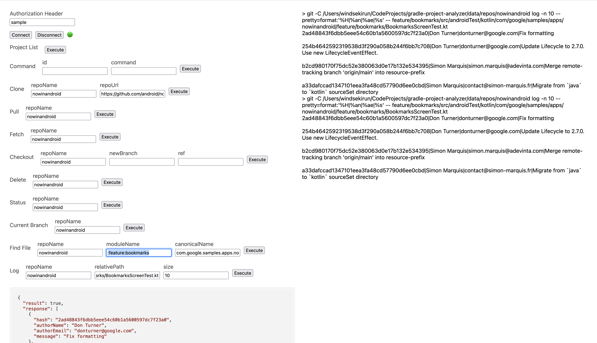

# docker-gradle-project-analyze

**Currently developing**

REST APIs that providing analysis functions of Gradle-based projects

## Features

- Clone/Checkout/Pull/Fetch/Log/Browse git projects
- Find relative path from moduleName (ex, :feature:bookmarks), canonicalName (ex, com.google.samples.apps.nowinandroid.feature.bookmarks.BookmarksScreenTest)
- Generate Cloc Report per module

## Demo

## Usage

### Production

1. `docker-compose up -d`
2. Access 'http://localhost:3000'

## Development

1. `pnpm i`
2. `pnpm start`
3. open 'demo/demo.html' in browser for demo page

## License

MIT License
